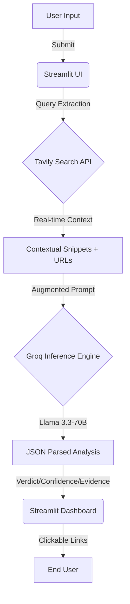

# 🛡️ TruthScanner AI: Real-Time Fact-Checking Engine

[](https://truthscannerai.streamlit.app)

**TruthScanner AI** is a high-speed, investigative OSINT (Open Source Intelligence) tool designed to combat misinformation in 2026. By combining the lightning-fast inference of **Groq LPU™** with the live web-indexing power of **Tavily AI**, TruthScanner provides deep verification of news claims, tweets, and headlines in seconds.

-----

## 📸 App Interface

| Input & Analysis | Evidence & Sources |
| :---: | :---: |
|  |  |
| *User enters a controversial claim* | *Detailed verdict with live source links* |
-----

## 🚀 Key Features

  * **Live Web Retrieval:** Uses Tavily's advanced search depth to bypass static training data.
  * **JSON-Structured Reasoning:** Forced Llama 3.3-70B output ensuring consistent UI metrics.
  * **Automated Source Validation:** Cross-references claims against reputable global news outlets (Reuters, AP, BBC).
  * **Confidence Scoring:** Provides a 0-100% certainty metric based on evidence density.
  * **Source Transparency:** Interactive cards with direct links to every source used in the analysis.

-----

## 🛠️ Tech Stack

| Technology | Purpose |
| :--- | :--- |
|  **Streamlit** | Frontend Dashboard & UI |
|  **Groq LPU™** | Ultra-low latency LLM Inference (Llama 3.3-70B) |
|  **Tavily AI** | Search Engine optimized for AI Agents |
|  **Python** | Core Logic & API Orchestration |
-----

## 📐 System Architecture

The following diagram illustrates the data flow from user input to the final verdict:



-----

## ⚙️ Installation & Local Setup

### 1\. Clone the repository

```bash
git clone https://github.com/shubham001official/truthscanner-ai.git
cd truthscanner-ai
```

### 2\. Install Dependencies

```bash
pip install -r requirements.txt
```

### 3\. Environment Configuration

Create a `.env` file in the root directory:

```env
GROQ_API_KEY=your_groq_api_key
TAVILY_API_KEY=your_tavily_api_key
```

### 4\. Run the Application

```bash
streamlit run app.py
```

-----

## 📖 How it Works: Code Breakdown

### The "Judge" Logic

Unlike traditional ML models that predict text based on probability, TruthScanner uses **RAG (Retrieval-Augmented Generation)**.

1.  **Retrieval:** The system searches for the top 6 most relevant "Advanced" web results.
2.  **Context Injection:** The raw content from these sources is injected into a "Fact-Checker" system prompt.
3.  **JSON Enforcement:** The LLM is restricted to a JSON output, allowing the app to programmatically color-code the UI (Green for True, Red for False).

-----

## 🤝 Contributing

Contributions are welcome\! Please feel free to submit a Pull Request. For major changes, please open an issue first to discuss what you would like to change.

## ⚖️ License

Distributed under the MIT License. See `LICENSE` for more information.

-----

**Disclaimer:** *TruthScanner AI is an investigative tool. Users should always manually verify critical information before making decisions.*
